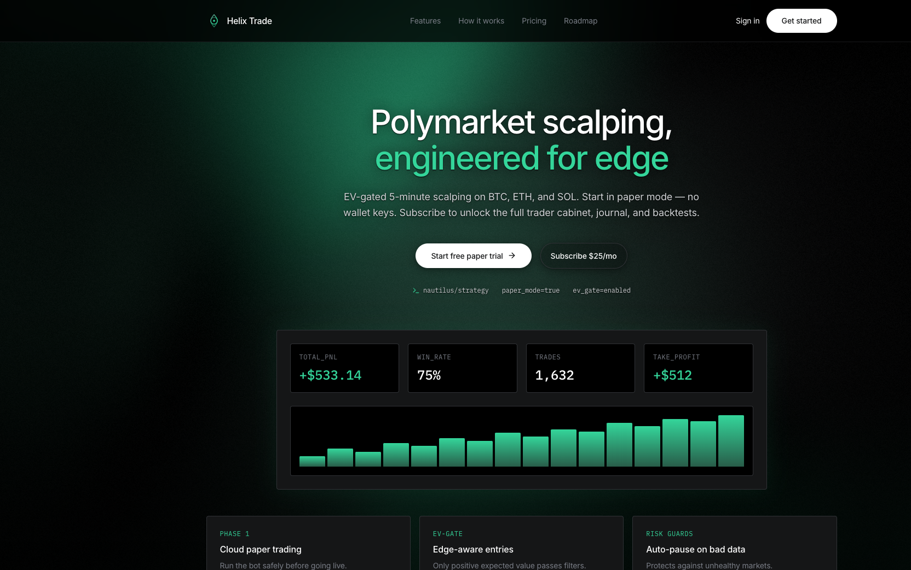
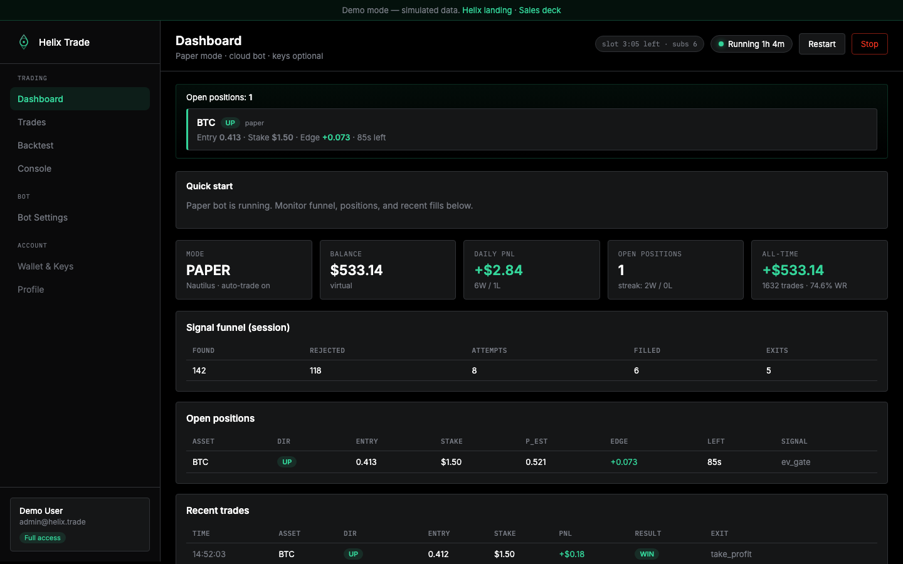
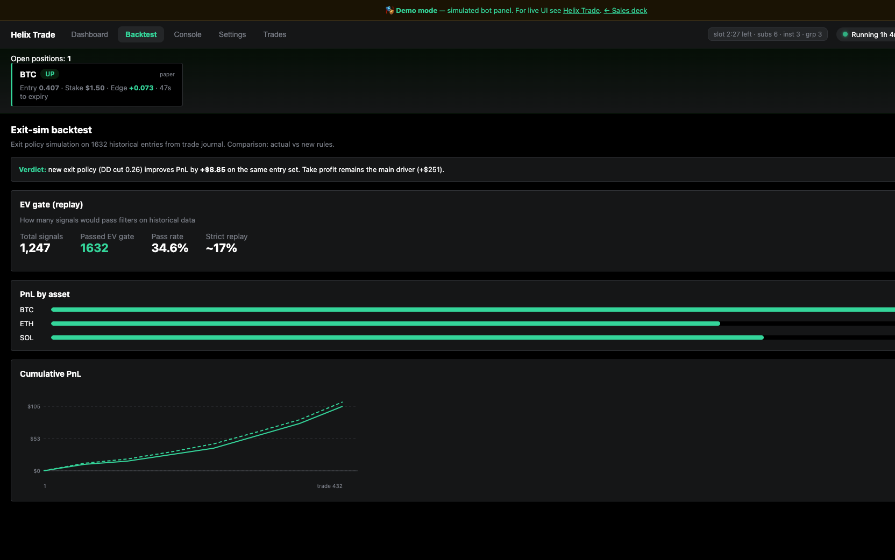
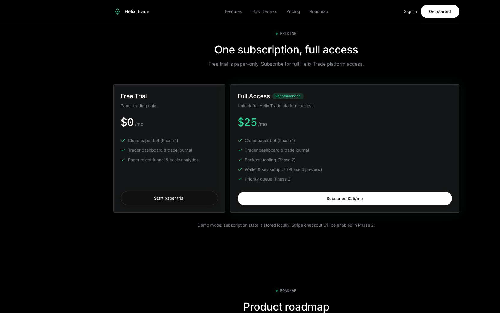

# Helix Trade — SaaS For Sale

**Turnkey Polymarket 5m scalping platform for BTC, ETH, and SOL.**

A complete product ready to launch as your own SaaS: branded website, trader dashboard, automated bot, subscription UX, and a verified paper-trading track record.

## Live preview

| Page | Link |
|------|------|
| **Sales deck** | [zirvey.github.io/Scalping-Bot-SaaS](https://zirvey.github.io/Scalping-Bot-SaaS/) |
| **Product UI** | [/helix/](https://zirvey.github.io/Scalping-Bot-SaaS/helix/) |
| **Bot demo** | [/demo/](https://zirvey.github.io/Scalping-Bot-SaaS/demo/) — sidebar trader cabinet (dashboard, trades, backtest, console) |

## Product screenshots

| | |
|:---:|:---:|
| **Landing & live stats** | **Trader dashboard** |
|  |  |
| **Backtest & performance** | **Pricing & subscriptions** |
|  |  |

## Track record

| Metric | Value |
|--------|-------|
| **Total PnL** | **+$533** |
| **Win rate** | **74.6%** |
| **Trades** | **1,632** |
| **Best exit** | take profit · +$419 |
| **Markets** | BTC · ETH · SOL (5-minute Up/Down) |

## What you are buying

- **Helix Trade brand & website** — landing, pricing, auth flows, neon design system
- **Trader cabinet** — dashboard, positions, trade journal, analytics
- **Automated scalping bot** — paper mode out of the box, live-ready architecture
- **Subscription model** — free trial + $25/mo full-access UX already designed
- **Proven strategy** — edge-based entries, risk guards, optimized exit rules
- **Full source handoff** — ready for white-label or direct launch

## Why buyers choose this

1. **Profitable history** — +$533 on paper with 1,632 logged trades
2. **Complete product** — not a script; website + bot + dashboard in one package
3. **SaaS-ready** — pricing, trials, and roadmap already built into the UI
4. **Low-friction onboarding** — users start in paper mode, no wallet required
5. **Growing market** — Polymarket 5-minute crypto markets
6. **Demo included** — buyers can explore UI and bot panel before purchase

## Licensing options

| Plan | Includes |
|------|----------|
| **Source license** | Full codebase, branding, bot, dashboard, documentation |
| **SaaS-ready** | Everything above + subscription flows & paper cloud setup |
| **Enterprise** | White-label, custom deployment, strategy support |

## Ideal buyer

- Founder launching a trading SaaS
- Agency selling white-label bot products
- Trader scaling a proven strategy to paying users
- Investor acquiring a launch-ready fintech asset

## Contact

_Add your email or Telegram for a live walkthrough, due diligence, and repository handoff._

---

*Disclaimer: past performance does not guarantee future profits. Not financial advice.*
